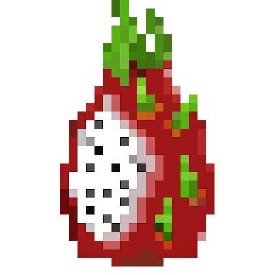

  

###

  
  
  

<h1 align="center">P1tayaa Profile</h1>

###

<h3 align="left">👩‍💻  About Me</h3>

###

I'm Samuel Boulain Holstaine from France   - 🔭 I’m studying at Codam (42 Amsterdam)  - 📚 I'm currently learning Rust  - ⚡ In my free time I Gamming

###

<h3 align="left">🛠 Language and tools</h3>

###

  
  
  
  
  
  
  
  
  
  
  
  
  
  
  <!-- 
   -->
  

###

<h3 align="left">🔥   My Stats :</h3>

###

  

###