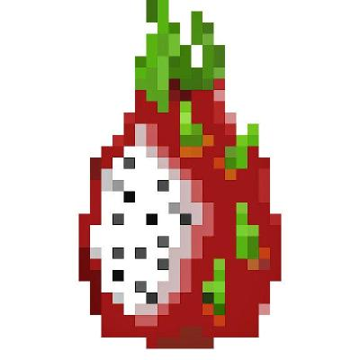

  

###

  
  
  

<h1 align="center">Samuel Boulain Holstaine — P1tayaa</h1>

###

<h3 align="left">👨‍💻 About Me</h3>

###

Software engineer from France, based in Berlin. I build real-time 3D interfaces, simulations and low-level systems, mostly in C, C++ and C#.
  
- 🎓 Graduated from the 42 Core Curriculum at Codam (42 Amsterdam) 
- 🚁 Last built the operator interface for an autonomous drone swarm — Godot UI, live lidar point clouds, a Python/ROS2 ground station 
- 🌱 Currently sharpening my Rust, and exploring generative-AI tooling 
- 🎲 Off the clock: game dev, tabletop RPGs (I run the table), and cooking

###

<h3 align="left">🛠 Languages and Tools</h3>

###

  
  
  
  
  
  
  
  
  
  
  
  
  
  
  
  
  
  
  
  
  
  
  
  
  

###

<h3 align="left">🚀 Selected Projects</h3>

###

<b><a href="https://github.com/P1tayaa/GODOTWFC">Wave Function Collapse Map Generator</a></b> — C#, Godot 
Implemented the WFC algorithm from scratch to generate coherent 2D maps from an adjacency rule set.
  
<b>Procedural Biome Generation</b> — Raylib, Odin 
A collecting game in a procedurally generated 2D world, layering Perlin-noise functions to build distinct biomes.
  
<b><a href="https://github.com/omathot/webserv">Webserv</a></b> — C++ 
An HTTP server hosting a live website; I owned the Python CGI execution and directory auto-indexing.
  
<b><a href="https://github.com/P1tayaa/Inception_42_sboulain">Inception</a></b> — Docker 
A full containerised infrastructure: a WordPress site on NGINX backed by a MariaDB database.
  
<b><a href="https://github.com/P1tayaa/minishell">Minishell</a></b> — C 
A Bash-like shell written from scratch — processes, pipes and Linux internals from the ground up.

###

<h3 align="left">📊 My Stats</h3>

###

  
  

  

###
